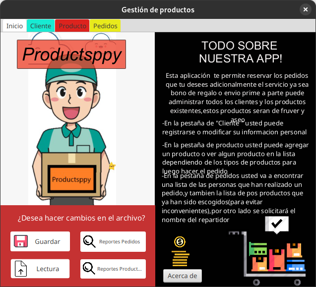
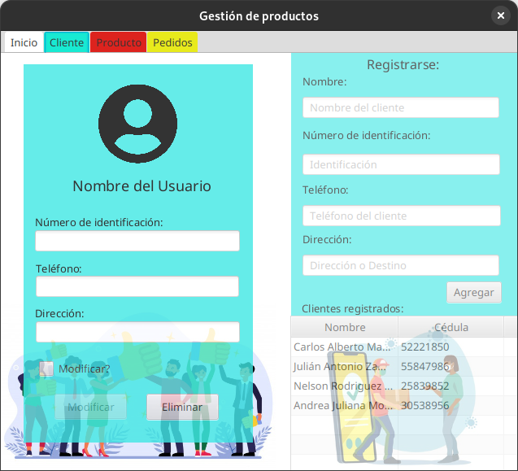
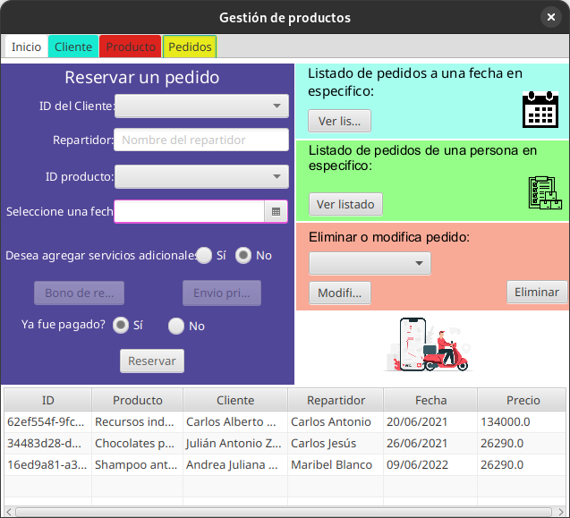
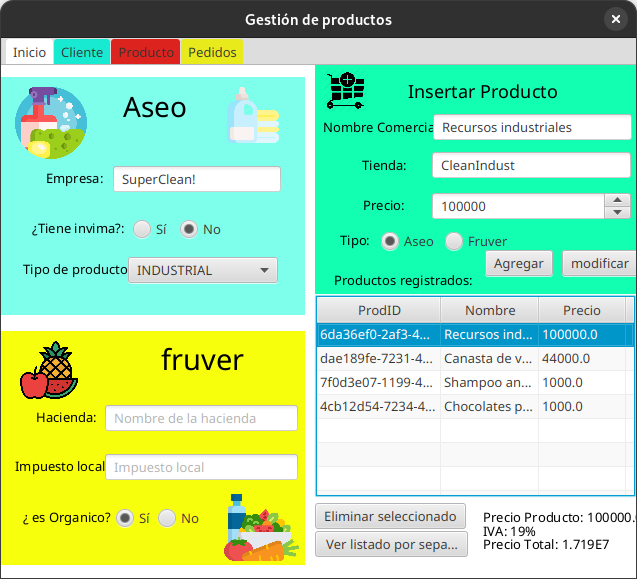
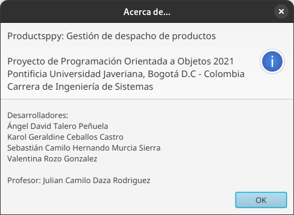

# ProyectoPOO
__Productsppy:__ Sistema de gestión para supermercado\
Proyecto final de la materia de 'Programación Orientada a Objectos'\
Pontificia Universidad Javeriana (2020)

Productsppy es un sistema de gestión para supermercados en el cual es posible registrar múltiples productos, clientes y pedidos.
El programa automáticamente gestiona el inventario y el historial de pedidos y toda esta información puede ser guardada en un archivo de Reporte o exportada en formato XML o JSON.

|                              |                                  |
| ---------------------------- | -------------------------------- |
|    |      |
|  |  |

### Detalles Técnicos
Este programa está desarrollado utilizando Java SE 17 y Maven como build system, las interfaces están hechas en JavaFX con ayuda de SceneBuilder, la serialización de objetos se realiza mediante la librería Jackson y JakartaXML.

### Créditos:
